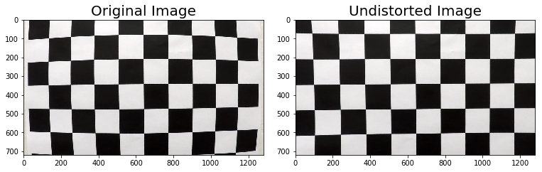
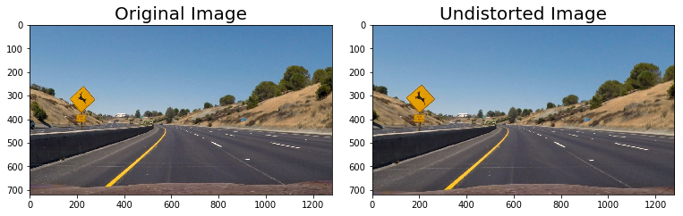
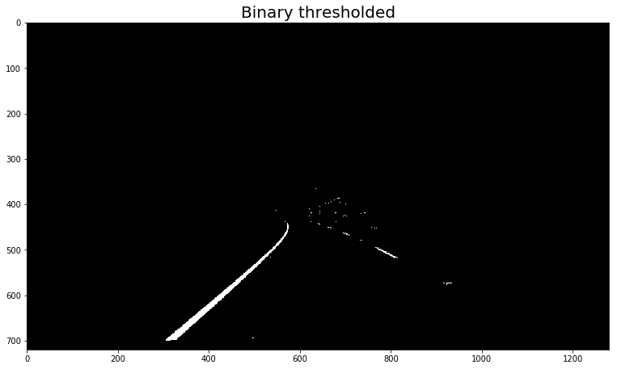
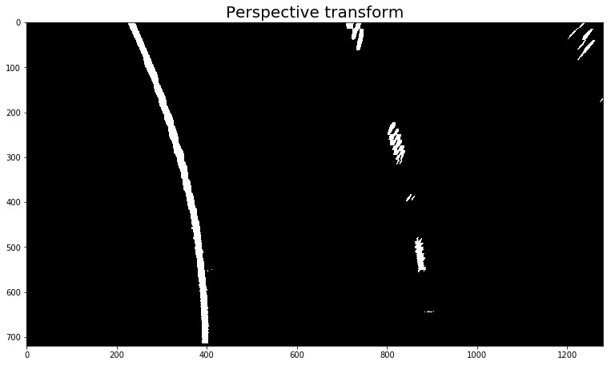
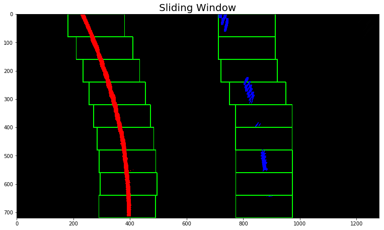
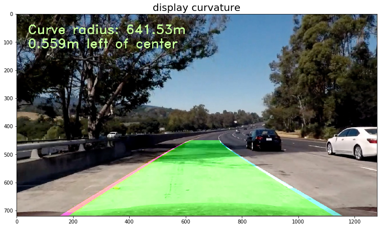

## CarND-Advanced-Lane-Finding

### The goal of this project is to identify the road lanes in a video stream from a moving vehicle mounted camera.

We'll be using image manipulation techniques to extract enough information from each frame, or image, of the video and identify the lane lines, the radius of curvature and the distance from the camera to the center line of the road.

---
**Folder structure**
- `camera_cal/` Directory with calibration images
- `test_images/` Directory with test images
- `output_images/` Directory with processed test images 
- `videos/` Directory with input and processed videos
- `AdvancedLandeFinding_r2` Jupyter notebook with all the project code and example images
- `wide_dist_pickle` Pickle file of cameraMatrix and distortionCoeffs s
- `README.md` Projecte writeup (you're reading it)

**Project Pipeline**
The steps of this project consist of the following:
* Compute the camera calibration matrix and distortion coefficients given a set of chessboard images.
* Apply a distortion correction to raw images.
* Use gradient threshold in the horizontal direction, gradient direction threshold, HLS color transform and then apply a region mask to the image to create a thresholded binary image.
* Apply a perspective transform to rectify binary image ("birds-eye view").
* Detect lane pixels and fit to find the lane boundary using sliding window search or polynomial search 
* Determine the curvature of the lane and vehicle position with respect to center.
* Warp the detected lane boundaries back onto the original image.
* Output visual display of the lane boundaries and numerical estimation of lane curvature and vehicle position.

[//]: # (Image References)

[image1]: output_images/calibration.png "Calibration Chessboard"
[image2]: output_images/calibration2.png "Camera Calibration"
[image3]: output_images/binary.png "Binary Thresholded"
[image4]: output_images/prestransform.png "Warp Example"
[image5]: output_images/slidingwindow.png "Sliding Window"
[image6]: output_images/finalimage.png "Output"
[image7]: output_images/curvature.png "Final Output"
[video1]: ovideos/project_video_processed.mp4 "Video"

## [Rubric](https://review.udacity.com/#!/rubrics/571/view) Points

### Here I will consider the rubric points individually and describe how I addressed each point in my implementation.  

---

### Writeup / README

#### 1. Provide a Writeup / README that includes all the rubric points and how you addressed each one.  You can submit your writeup as markdown or pdf.  [Here](https://github.com/udacity/CarND-Advanced-Lane-Lines/blob/master/writeup_template.md) is a template writeup for this project you can use as a guide and a starting point.  

You're reading it!

### Camera Calibration

#### 1. Briefly state how you computed the camera matrix and distortion coefficients. Provide an example of a distortion corrected calibration image.

First we have to calibrate the camera image to correct for the distortions. To accomplish this, we can use a series of images of a chessboard taken at various angles already provided in `camera_cal/` directory. Using openCV's `findChessboardCorners()`, we can easily find the corners. During this calibration process `objpoints` will be appended when we successfully detect all chessboard corners in a test image.  `imgpoints` will be appended with the (x, y) pixel position of each of the corners in the image plane with each successful chessboard detection. Then using the output `objpoints` and `imgpoints` we can compute and save the camera calibration and distortion coefficients using the `cv2.calibrateCamera()` function. `cv2.undistort()` function can be used to correct the distortions The image on the left shows the raw image while the image on the right has been undistorted:



### Pipeline (single images)

#### 1. Provide an example of a distortion-corrected image.

The same set of camera calibration and distortion coefficients can be used to apply the distortion correction to one of the test images as:



#### 2. Describe how (and identify where in your code) you used color transforms, gradients or other methods to create a thresholded binary image.  Provide an example of a binary image result.

After correcting the distortions, we can use gradient threshold in the horizontal direction, gradient direction threshold, HLS color transform to detect right yellow and white line and then apply a region mask to the image to create a thresholded binary image. The threshold values are determined by trial and error. Code snippet showing the implementation is as follows,
```Python
combinedbinary = (rgbinary & lbinary) & (sbinary | sxdirbinary)
```
After the binary image is achieved, we can use a region mask to isolate the lane lines.
```Python
mask = np.zeros_like(s_channel)
region_of_interest = np.array([[0,gray.shape[0]-1], [gray.shape[1]/2, int(0.5*gray.shape[0])], [gray.shape[1]-1, gray.shape[0]-1]], dtype=np.int32)
cv2.fillPoly(mask, [region_of_interest], 1)
color_binary = cv2.bitwise_and(combinedbinary, mask)
```
Resulting binary image is:



#### 3. Describe how (and identify where in your code) you performed a perspective transform and provide an example of a transformed image.

Next is the perspective transform. We can set four points on the image roughly outlining the lane and transforming them into parallel lines that represent a bird's eye view of the lane. openCV's getPerspectiveTransform takes the source (`src`)and destination points (`dst`)and returns the transform matrix that is needed to created the warped lane.  

```python
# manually define the vertices for perspecive transform
leftbottom=[150,720] 
rightbottom=[1250,720] 
lefttop=[590,450] 
righttop=[700,450]
src=np.float32([leftbottom,lefttop,righttop,rightbottom])
copy = img.copy()
cv2.polylines(copy,np.int32(np.array([[leftbottom,lefttop,righttop,rightbottom]])),True,(0,0,255),5)
# Destination points
leftbottom = [320,720]
rightbottom = [920, 720]
lefttop = [320, 1]
righttop = [920, 1]
dst=np.float32([leftbottom,lefttop,righttop,rightbottom])
M = cv2.getPerspectiveTransform(src, dst)
M_inv = cv2.getPerspectiveTransform(dst, src)
img_size = (img.shape[1], img.shape[0])
warped = cv2.warpPerspective(img, M, img_size , flags=cv2.INTER_LINEAR)
```
The following image is an example of a warped lane:



#### 4. Describe how (and identify where in your code) you identified lane-line pixels and fit their positions with a polynomial?

Next we can detect the x position of the lane lines using a histogram to find the highest pixel values in the image. Then that x-position can be used as a sliding window search to find other high pixel areas. Numpy's polyfit function can be used to fit polynomials with the selected x-values using `find_lane_pixels(binary_warped)`.  Within a margin of the previously detected lane we can simply search and fit a polynomial for lane line using `search_around_poly(binary_warped, left_fitprev, right_fitprev)`. 
Result of sliding window search is as below:



#### 5. Describe how (and identify where in your code) you calculated the radius of curvature of the lane and the position of the vehicle with respect to center.

Nowe we can calculate the curvature of the lane as well as the distance of the vehicle from center. To calculate the lane curvature, we can use the radius of curvature equation(https://en.wikipedia.org/wiki/Radius_of_curvature) implemented as `measure_curvature_real(binary_warped,left_fit,right_fit)`. To calculate the distance from center we can simply subtracted the center of the lane from the center of the image  and converted from pixels to meters.

#### 6. Provide an example image of your result plotted back down onto the road such that the lane area is identified clearly.

After implenting the pipe line we can now see an example of the result on a test image:



---

### Pipeline (video)

#### 1. Provide a link to your final video output.  Your pipeline should perform reasonably well on the entire project video (wobbly lines are ok but no catastrophic failures that would cause the car to drive off the road!).

Here's a [link to my video result](videos/project_video_processed.mp4)

---

### Discussion

#### 1. Briefly discuss any problems / issues you faced in your implementation of this project.  Where will your pipeline likely fail?  What could you do to make it more robust?

The pipeline performs well on the project video with limited parameter tuning of the thresholding and smoothing steps. However it does not that well on the challenge videos. This pipeline can't detect lanes with steep curved lane lines or lane in direct sunlight and occluded by shadows. Hence, this pipeline fails in the harder challenge video.
 Some of the possible methods we can use are,
 * To detect steep curves, we could be apply a vertical sliding window in addition to the horizontal window.
* To detect lane lines in direct sunlight/shadows, we could create a line planning algorithm that will predict where the line will go next and explore other colour space to detect the lanes 